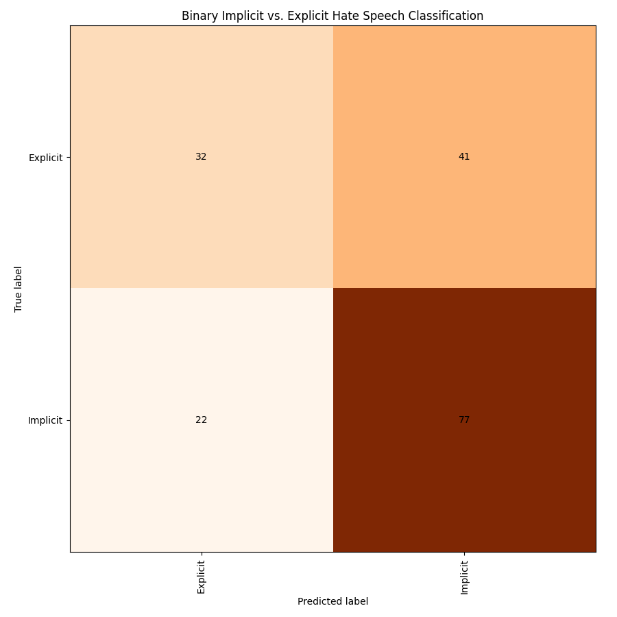
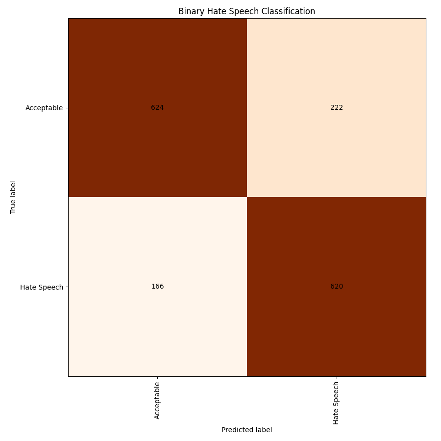
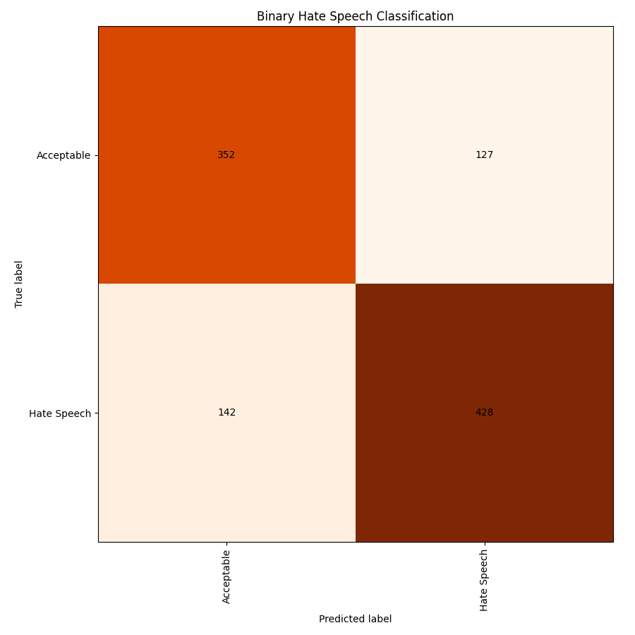

# Hate-Speech-Classification
 Experiments with binary classification of hate speech and its implicitness.

The spreadsheets (the original one from the Google Sheets - *Hate-Speech-Classification/data/Implicit hate speech.xlsx* and the ones that I prepared) are located in the folder **data**.

First, I prepared the data into the format that is required for experiments with Transformers - see the code in *Hate-Speech-Classification/1-Data-Preparation.ipynb*. The following interventions were performed:
* Only comments are used, posts are discarded (as they are not annotated).
* `-*-*-*- ` which indicates whether the comment is a reply to another comment was deleted from the comment text
* empty comments are discarded
* duplicated comments are discarded
* in the binary classification of hate speech (with two classes: acceptable and hate speech), instances that are annotated with both labels at once are discarded

The text length in no. of words (of the entire dataset, used for the two experiments):

| count |     5706      |
|-----|-----|
| mean  |       34.0135 |
| std   |       55.6401 |
| min   |        1      |
| 25%   |        8      |
| 50%   |       18      |
| 75%   |       38      |
| max   |     1387      |

## Experiments

I performed 2 experiments:
* Experiment 1: binary classification of comments annotated for implicitness of hate speech. We have two classes: implicit hate speech (1) and explicit hate speech (0)
* Experiment 2: binary classification of hate speech. We have two classes: acceptable speech (0) and hate speech (1)

The code for the experiments is available on Kaggle:

* Experiment 1: https://www.kaggle.com/tajakuz/implicit-hate-speech-classification
* Experiment 2: https://www.kaggle.com/code/tajakuz/hate-speech-binary-classification

## Experiment 1: Implicitness

The statistics for the dataset:

|Label|Count|Perc|
|-----|-----|-----|
| Implicit | 329 |0.576|
| Explicit | 242 |0.424|
| Total | 571 |1|

I used only the data that was annotated for implicitness and belongs to hate speech and split it into train and test split in a 70:30 manner based on a stratified split.

Results:

| model   |   microF1 |   macroF1 |   accuracy |
|:--------|----------:|----------:|-----------:|
| dummy   |  0.575581 |  0.365314 |      0.576 |
| BERT    |  0.633721 |  0.606807 |      0.634 |

We can see that BERT performs better than the baseline.

I experimented with different numbers of epochs and the results revealed the optimum number is 60.

Interestingly, the prediction of implicit instances seems to be much easier than explicit instances. However, we have much more implicit instances in our data than explicit ones which could impact the results.

## Experiment 2: Hate Speech

|Label|Count|Perc|
|:------------------|---------------------:|---------------------:|
| Acceptable speech |                 2821 |0.519|
| Hate speech       |                 2619 |0.481|
| Total | 5440 |1|

### Results on a stratified split of all data

Results when I split the hate speech dataset in a 70:30 manner based on a stratified split (based on the label distribution):

| model   |   microF1 |   macroF1 |   accuracy |
|:--------|----------:|----------:|-----------:|
| dummy   |  0.518382 |  0.341404 |      0.518 |
| BERT    |  0.762255 |  0.762253 |      0.762 |

### Results on all newly annotated data in test split

Results when I used all the data that was not yet annotated with implicitness as train data (4391 instances) and all annotated data (hate speech and acceptable speech instances) as test data (1049).

| model   |   microF1 |   macroF1 |   accuracy |
|:--------|----------:|----------:|-----------:|
| dummy   |  0.456625 |  0.313482 |      0.457 |
| BERT    |  0.743565 |  0.742212 |      0.744 |

We can see the dummy classifier performs worse than before, because the label distribution in both splits is not the same.

Although the Transformer model performs slightly worse than in the first case, it outperforms the baseline for 29 points (in micro F1), which is significant.

The results show that these experiments gave better results than prediction of implicitness. However, here, the model was trained on 10x more instances. The experimentation with different numbers of epochs revealed that training the model for 20 epochs gives the best results.

From the confusion matrix we can see that a higher percentage of acceptable texts is misclassified as hate speech than vice versa.

#### Results for each type of hate speech (implicit/explicit)

| type of HS   |   microF1 |   macroF1 |   accuracy |   precision |   recall |   HS label F1 score |
|:--------|----------:|----------:|-----------:|-----------:|-----------:|-----------:|
| implicit   |  0.683 |  0.406 |      0.683 |1.0|0.683| 0.812|
| explicit    |  0.843 |  0.457 |      0.843 |1.0|0.843| 0.915|

The results show that hate speech prediction is easier on explicit hate speech.

